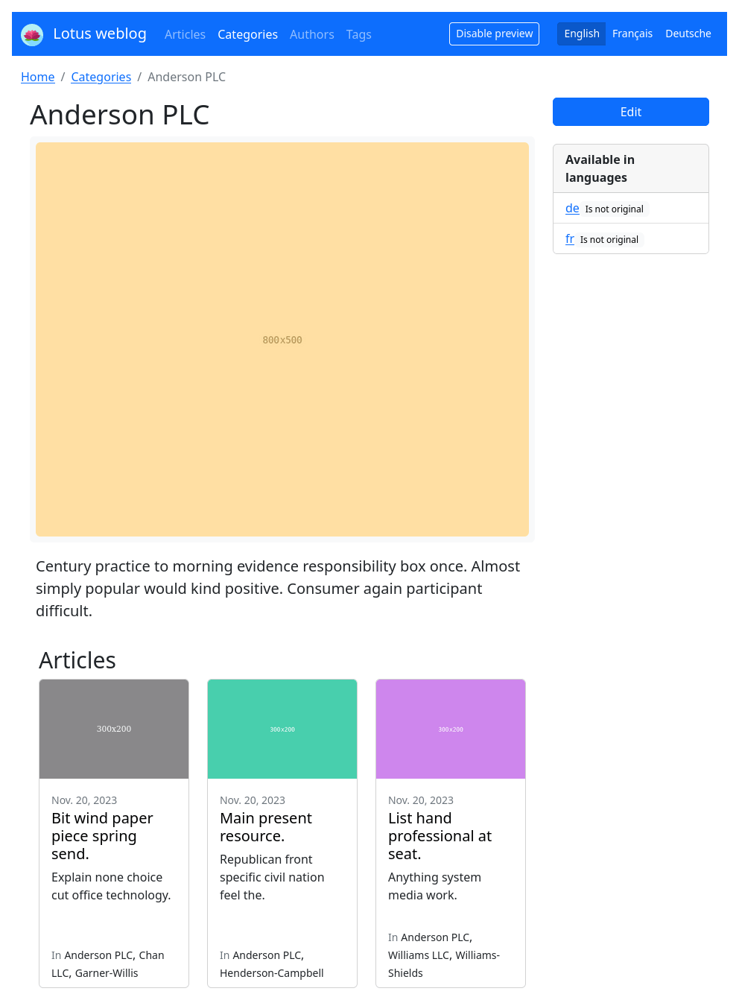
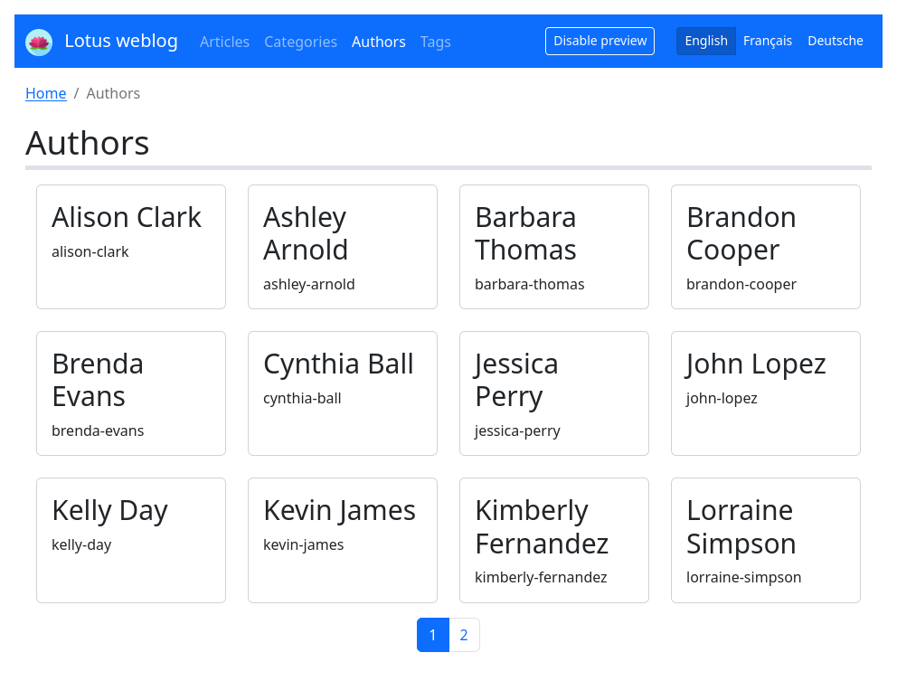

.. _django-smart-media: https://github.com/sveetch/django-smart-media
.. _django-view-breadcrumbs: https://github.com/tj-django/django-view-breadcrumbs
.. _django-taggit: https://github.com/jazzband/django-taggit

.. _demonstration_intro:

=============
Demonstration
=============

Here is a set of screenshots of all views, contents are dummy since it comes from
generated demonstration being logged in as an administrator. As you will
see Lotus include a very pretty basic layout from a barebone Bootstrap v5.

.. |article-list| image:: _static/demo/article-list.png
.. |article-detail| image:: _static/demo/article-detail.png
.. |category-list| image:: _static/demo/category-list.png

.. |author-detail| image:: _static/demo/author-detail.png

.. list-table:: Click image to see larger version.
   :class: borderless

   * - .. figure:: /_static/demo/thumb_article-list.png
          :align: center
          :target: _images/article-list.png

          Article list

     - .. figure:: /_static/demo/thumb_article-detail.png
          :align: center
          :target: _images/article-detail.png

          Article detail

     - .. figure:: /_static/demo/thumb_category-list.png
          :align: center
          :target: _images/category-list.png

          Category detail

   * - .. figure:: /_static/demo/thumb_category-detail.png
          :align: center
          :target: _images/category-detail.png

          Category detail

     - .. figure:: /_static/demo/thumb_author-list.png
          :align: center
          :target: _images/author-list.png

          Author list

     - .. figure:: /_static/demo/thumb_author-detail.png
          :align: center
          :target: _images/author-detail.png

          Author detail

.. Note::

    Screenshots may differ a little from current release depending new features.

See :ref:`install_demo` to know how to install demonstration on your machine.
