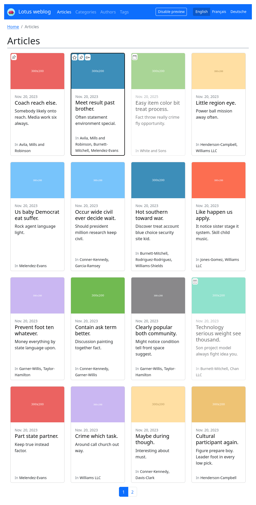
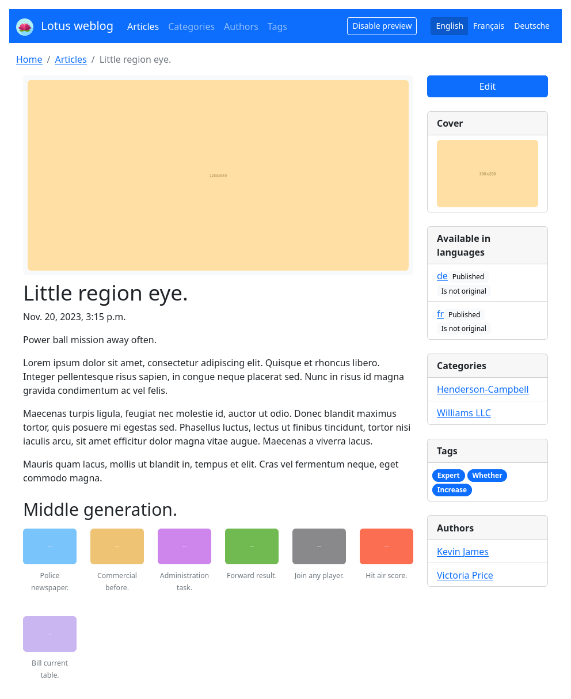

.. django-blog-lotus documentation master file, created by David Thenon

.. include:: ../README.rst

Sample screens
**************

Here is a set of screenshots of all views with contents from generated demonstration
being logged in as an administrator with default Bootstrap layout.

.. |category-list| image:: _static/demo/category-list.png
.. |category-detail| image:: _static/demo/category-detail.png
.. |author-list| image:: _static/demo/author-list.png
.. |author-detail| image:: _static/demo/author-detail.png

.. list-table:: Click image to see larger version.
   :class: borderless

   * - .. figure:: /_static/demo/thumb_article-list.png
          :align: center
          :target: _images/article-list.png

          Article list

     - .. figure:: /_static/demo/thumb_article-detail.png
          :align: center
          :target: _images/article-detail.png

          Article detail

     - .. figure:: /_static/demo/thumb_category-list.png
          :align: center
          :target: _images/category-list.png

          Category list

   * - .. figure:: /_static/demo/thumb_category-detail.png
          :align: center
          :target: _images/category-detail.png

          Category detail

     - .. figure:: /_static/demo/thumb_author-list.png
          :align: center
          :target: _images/author-list.png

          Author list

     - .. figure:: /_static/demo/thumb_author-detail.png
          :align: center
          :target: _images/author-detail.png

          Author detail

   * - .. figure:: /_static/demo/thumb_tag-detail.png
          :align: center
          :target: _images/tag-detail.png

          Tag detail

     - .. figure:: /_static/demo/thumb_tag-list.png
          :align: center
          :target: _images/tag-list.png

          Tag list

     -

Contents
********

.. toctree::
   :maxdepth: 2

   install.rst
   settings.rst
   contents.rst
   languages.rst
   publication.rst
   medias.rst
   breadcrumbs.rst
   api.rst
   sitemaps.rst
   layout.rst
   permissions.rst
   core/index.rst

About the project
*****************

.. toctree::
   :maxdepth: 1

   development.rst
   history.rst
   migrations.rst
