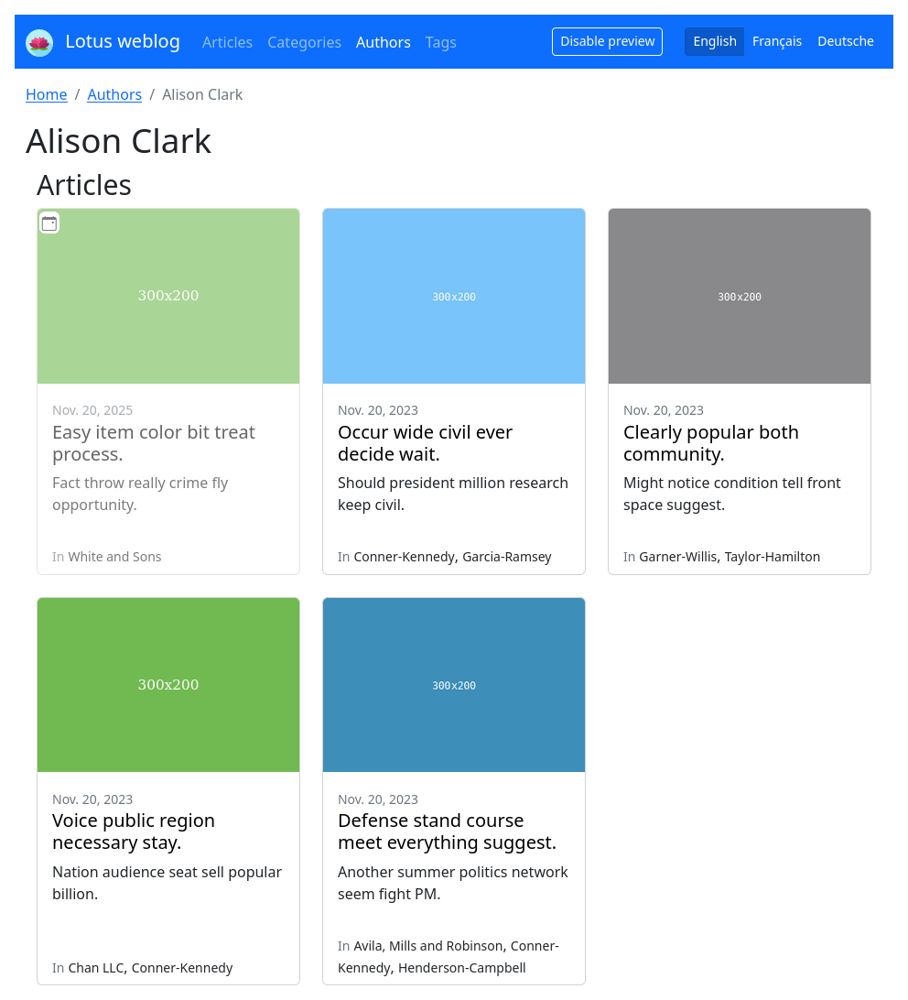

.. _django-smart-media: https://github.com/sveetch/django-smart-media
.. _django-view-breadcrumbs: https://github.com/tj-django/django-view-breadcrumbs
.. _django-taggit: https://github.com/jazzband/django-taggit

.. _intro_overview:

========
Overview
========

Demonstration
*************

Here is a set of screenshots of all views, content are dummy since it comes from
generated :ref:`intro_install_demo` being logged in as an administrator. As you will
see Lotus include a very pretty basic layout from a barebone Bootstrap v5.

.. |article-list| image:: _static/demo/article-list.png
.. |article-detail| image:: _static/demo/article-detail.png

.. |category-detail| image:: _static/demo/category-detail.png
.. |author-list| image:: _static/demo/author-list.png

.. list-table:: Click image to see larger version.
   :class: borderless

   * - .. figure:: /_static/demo/thumb_article-list.png
          :align: center
          :target: _images/article-detail.png

          Article list

     - .. figure:: /_static/demo/thumb_article-detail.png
          :align: center
          :target: _images/article-detail.png

          Article detail

     - .. figure:: /_static/demo/thumb_category-list.png
          :align: center
          :target: _images/category-list.png

          Category detail

   * - .. figure:: /_static/demo/thumb_category-detail.png
          :align: center
          :target: _images/category-detail.png

          Category detail

     - .. figure:: /_static/demo/thumb_author-list.png
          :align: center
          :target: _images/author-list.png

          Author list

     - .. figure:: /_static/demo/thumb_author-detail.png
          :align: center
          :target: _images/author-detail.png

          Author detail

.. Note::

    Screenshots may differ a little from current release depending new features.

Structure
*********

Lotus is a simple weblog engine that focus on proper content. There is multiple content
kinds:

Author
    This is a simple **proxy object to Django user object**. They are assigned to
    articles as a simple references. Author does not have any additional contents to a
    Django user.

Category
    A category is just a **container to organize your main article thematics**. It has
    a title, a cover and a free description.

    A category detail will list its related articles.

Tag
    This is **alike Category but serve another content structure purposes**. They are
    managed with `django-taggit`_ and does not have any other content than a name and a
    slug.

    These tags can be shared with another applications using `django-taggit`_ but Lotus
    views are made to only show tag related to articles.

    A tag detail will list its related articles. Tags are not subject to translation or
    language, a same tag can be shared throught differents languages.

    .. Warning::

        The tag slug ``autocomplete`` should be forbidden to create since this word
        is used in some urls, therefore the Tag detail page would never be reachable.

Article
    The most important document kind. **An article have many content types** and relate
    to authors, categories, tags and other articles (in the same language).

    In addition to **publication dates**, an article have many **state kinds** which
    **influence its visibility** and may be used to change its look in layout
    integration.

Internationalization, localization and content translation
**********************************************************

Lotus include everything to make a weblog in many languages.

Internationalization
....................

**Language is selected from URL request** with a prefix like ``/fr/`` and user can
choose to browse in another one using the language menu.

This **menu will switches user to the language** index page. On default when user has no
session yet and come on site without the language prefix, its **language is guessed
from its browser** and fallback on the default site one.

Available languages are defined from
`Django settings <https://docs.djangoproject.com/en/4.1/ref/settings/#languages>`_.

.. Note::

    If you remove an available language from your settings all object related to
    removed language will remain untouched in your database, however they won't be
    reachable anymore from your site frontend.

Localization
............

All frontend interface textes can be translated through
`Django localization <https://docs.djangoproject.com/en/4.1/topics/i18n/translation/#how-to-create-language-files>`_
with message files (``*.po`` files) but Lotus only support english and french for now.

Content translation
...................

**Category** and **Article** objects can be translated to an available language.

Lotus does not store translation on the same object. Instead **a new object is created
for each language** then related to the original one.

An object is considered as an original if it does not have any relation to another
"original" object. An object with a relation to another original is considered as a
"translation".

.. Note::

    * An object can only relate to a single original object;
    * You can't create a translation in the same language than the original one;
    * You can't create a translation with the same language twice;

    You can change article language and original relation at any time but it will be
    validated against these rules.

Since translation objects are complete new objects, you can change every content from
a language version to another.

Finally **Lotus never mixes and list objects from different languages**, only objects
for the user selected language. With the "original" and "translation" conception, an
user can go to another object language version since they are listed in object detail
page. Also this concept allow you to have object dedicated to a single specific
language.

Concretely as it can be seen from Article admin, objects will list to this tree: ::

    .
    ├── cheese
    ├── bread
    ├── fromage
    ├── pain
    └── omelette

But browsing objects would resolve to this sitemap tree: ::

    .
    ├── en
    │   ├── cheese
    │   └── bread
    └── fr
        ├── fromage
        ├── pain
        └── omelette

So a french user would see this Article list: ::

    ├── fromage
    ├── pain
    └── omelette

And see the english article tree if it switches to this language.

Publication criterias and visibility
************************************

There are many parameters involved to show an Article in listing or detail views.

All of these parameters make a combination of criterias where a single one can prevent
to display an article.

The article language
    It is not considered as a publication criteria but will avoid to list articles in
    another language than the user selected one.

The publication status
    By default an article is a "draft" but admin writer can choose to pass it as
    "available" and vice versa as much as it wants.

    A draft article is not reachable from lambda users, but admins can view them in
    Django admin or in frontend with the "Preview mode".

The publication dates
    An article got publication start and end dates. The start date is used against the
    current date time to determine when the article can be displayed and the optional
    end date to determine when it will be hidden forever.

    An article without the optional end date will be showed forever.

States
    Additionally article can select multiple visibility states.

    * **Pinned**: The article is always displayed at the very top of article list even
      before other non pinned articles with a more recent start date. However pinned
      articles adopt the start date ordering between them;
    * **Private**: A private article is only displayed to any logged in users;
    * **Favorite**: This does not affect the visibility but can be used in custom layout
      to visually mark this article or used in some code to get them apart;

.. Note::

    Commonly, all querysets from views that use Article relation are subject to
    criterias. For example, a Category detail view won't show private or draft articles
    to an anonymous user.

Image contents
**************

Category and Article object have some image contents. These content are managed through
`django-smart-media`_ library which allow for any supported format from PIL plus a
soft SVG support.

**You can upload a SVG file but it won't have a generated thumbnail** alike other
formats since it is assumed that vectorial format can resize to fit anywhere.

**All uploaded files are renamed with an unique ID** so they are always unique and avoid
any encoding issues from filename.

Breadcrumbs
***********

Every page include breadcrumbs from starting site entry point (commonly the homepage)
to the current page if `django-view-breadcrumbs`_ has been installed as explained from
:ref:`intro_install` document, read the `django-view-breadcrumbs`_ documentation for
more informations on its available settings.

Layout integration
******************

Every included templates have been made for Bootstrap v5 components. The application
does not embed any stylesheets or Javascript files for this integration, you may
retrieve everything to build them into your project from the repository.

However there is only a very few CSS enhancements around states icons, that you could
just start on your own Bootstrap v5 build.

Writing permission
******************

There is currently no specific permissions management. All admin users can create, edit
and delete anything.
